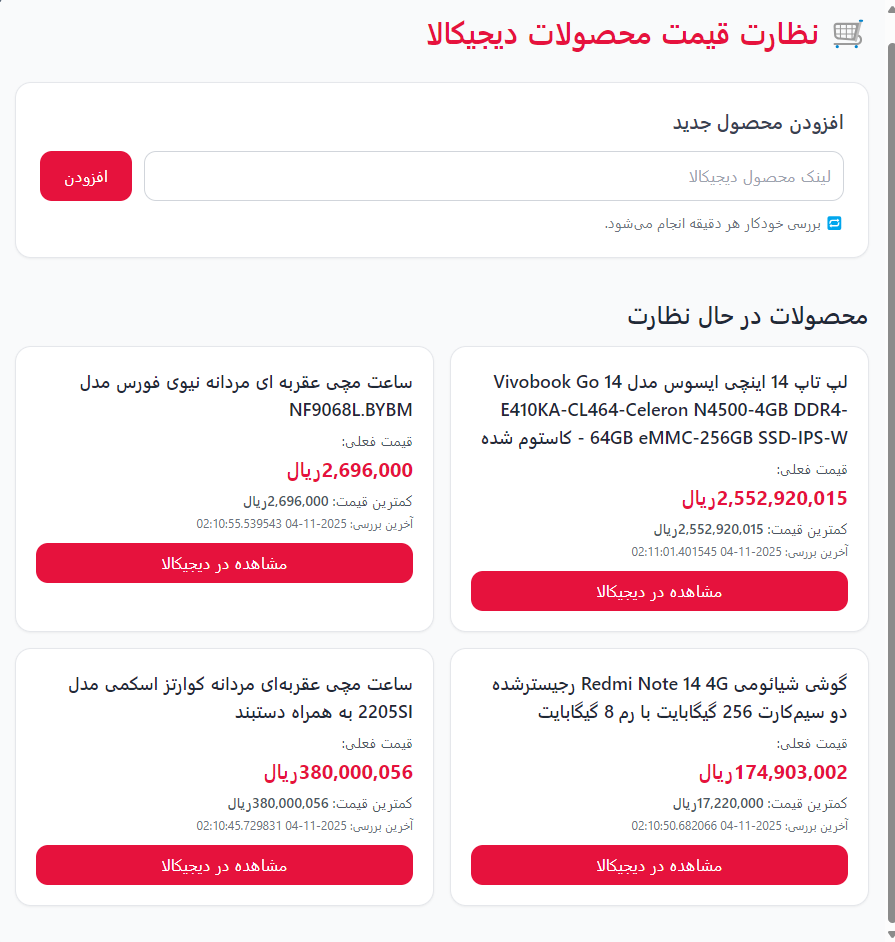
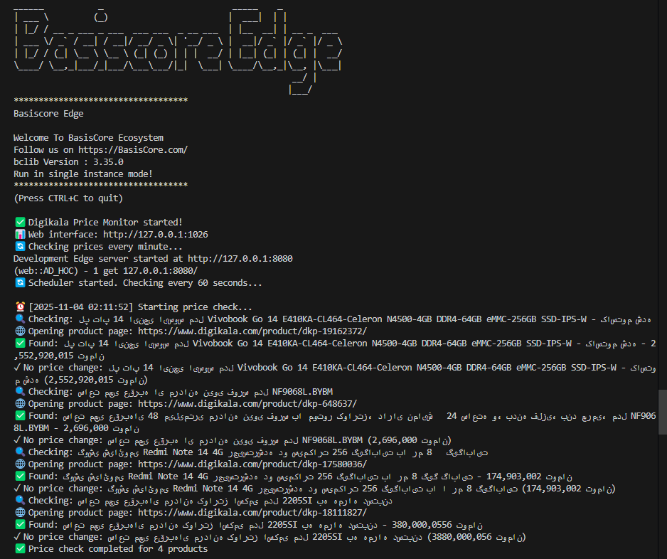

# 🛒 BasisCore Digikala Price Monitor

> سیستم نظارت خودکار قیمت محصولات دیجیکالا با استفاده از فریمورک [BasisCore.Server.Edge](https://github.com/Manzoomeh/BasisCore.Server.Edge)

[](https://www.python.org/)
[](https://basiscore.com/)
[](https://playwright.dev/)
[](LICENSE)

سیستمی هوشمند برای پیگیری خودکار قیمت محصولات دیجیکالا که به محض کاهش قیمت، از طریق ایمیل به شما اطلاع می‌دهد.

## ✨ ویژگی‌ها

- 🔍 **نظارت خودکار**: بررسی قیمت‌ها به صورت دوره‌ای (هر دقیقه)
- 📧 **اطلاع‌رسانی ایمیلی**: دریافت ایمیل زیبا هنگام کاهش قیمت
- 💾 **تاریخچه قیمت‌ها**: ذخیره تمام تغییرات قیمت در SQLite
- ⚡ **سریع و کارآمد**: استفاده از Playwright برای دریافت قیمت واقعی
- 🔒 **امن**: تمام داده‌ها به صورت محلی ذخیره می‌شوند

## 📸 تصاویر


<div align="center">
  
  
  
</div>


## 🏗️ معماری پروژه

این پروژه از **BasisCore.Server.Edge** به عنوان فریمورک اصلی استفاده می‌کند:

```
┌─────────────────────────────────────────┐
│  BasisCore Web Server (Port 8080)      │
│  ├── Web Routes                         │
│  ├── Request/Response Handling          │
│  └── Context Management                 │
└──────────────┬──────────────────────────┘
               │
               ▼
┌─────────────────────────────────────────┐
│  Price Monitor Components               │
│  ├── Scraper (Playwright)              │
│  ├── Database (SQLite)                  │
│  ├── Notifier (Email)                   │
│  └── Scheduler (Async)                  │
└─────────────────────────────────────────┘
```

## 📋 پیش‌نیازها

- **Python** 3.7 یا بالاتر
- **BasisCore.Server.Edge** - فریمورک وب
- **Playwright** - برای دریافت محتوای JavaScript
- **Git** - برای کلون کردن پروژه

## 🚀 نصب و راه‌اندازی

### مرحله 1: کلون کردن پروژه

```bash
git clone https://github.com/YOUR_USERNAME/basiscore-digikala-price-monitor.git
cd basiscore-digikala-price-monitor
```

### مرحله 2: نصب BasisCore.Server.Edge

```bash
# کلون کردن BasisCore
git clone https://github.com/Manzoomeh/BasisCore.Server.Edge.git

# رفتن به دایرکتوری BasisCore
cd BasisCore.Server.Edge

# نصب BasisCore
pip install -e .

# بازگشت به دایرکتوری اصلی
cd ..
```

### مرحله 3: نصب وابستگی‌های پروژه

```bash
# نصب کتابخانه‌های Python
pip install -r requirements.txt

# نصب Chromium برای Playwright
playwright install chromium
```

### مرحله 4: تنظیمات

```bash
# کپی کردن فایل نمونه تنظیمات
copy config.example.py config.py
# در لینوکس/مک: cp config.example.py config.py
```

حالا فایل `config.py` را باز کنید و موارد زیر را تنظیم کنید:

#### ✉️ تنظیمات ایمیل (Gmail):

```python
EMAIL_CONFIG = {
    "smtp_server": "smtp.gmail.com",
    "smtp_port": 587,
    "sender_email": "your-email@gmail.com",      # ایمیل شما
    "sender_password": "your-app-password",      # رمز اپلیکیشن
    "recipient_email": "your-email@gmail.com"    # ایمیل دریافت‌کننده
}
```

**نکته مهم**: برای Gmail حتماً از **App Password** استفاده کنید:

1. به [Google Account Security](https://myaccount.google.com/security) بروید
2. **2-Step Verification** را فعال کنید
3. به بخش **App passwords** بروید
4. یک رمز برای **Mail** بسازید
5. رمز 16 رقمی را کپی و در `sender_password` قرار دهید

#### 🛠️ تنظیم مسیر BasisCore:

```python
BASISCORE_PATH = r"C:\PATH\TO\BasisCore.Server.Edge"
```

مسیر BasisCore را که در مرحله 2 کلون کردید، وارد کنید.

### مرحله 5: اجرا

```bash
python main.py
```

پیام‌های زیر را خواهید دید:

```
✅ Digikala Price Monitor started!
📊 Web interface: http://127.0.0.1:8080
🔄 Checking prices every minute...
```

### مرحله 6: باز کردن داشبورد

مرورگر خود را باز کنید و به آدرس زیر بروید:

```
http://127.0.0.1:8080
```

## 📖 نحوه استفاده

### 1️⃣ افزودن محصول

1. به صفحه [دیجیکالا](https://www.digikala.com) بروید
2. محصول مورد نظر را پیدا کنید
3. لینک صفحه محصول را کپی کنید (مثال: `https://www.digikala.com/product/dkp-123456/`)
4. در داشبورد، لینک را در کادر وارد کنید
5. دکمه **افزودن** را بزنید

### 2️⃣ نظارت خودکار

- سیستم هر دقیقه (قابل تنظیم) قیمت محصولات را بررسی می‌کند
- در صورت کاهش قیمت، فوراً ایمیل دریافت خواهید کرد
- تمام تاریخچه قیمت‌ها در دیتابیس ذخیره می‌شود

### 3️⃣ مشاهده تاریخچه

- در داشبورد، تمام محصولات با آخرین قیمت نمایش داده می‌شوند
- کمترین قیمت ثبت شده برای هر محصول نمایش داده می‌شود
- زمان آخرین بررسی نمایش داده می‌شود

## 📁 ساختار پروژه

```
basiscore-digikala-price-monitor/
│
├── main.py                      # فایل اصلی برنامه
├── config.py                    # تنظیمات (نباید در git باشد)
├── config.example.py            # نمونه تنظیمات
├── requirements.txt             # وابستگی‌های Python
├── README.md                    # این فایل
├── .gitignore                   # فایل‌های نادیده گرفته شده
│
├── price_monitor/               # ماژول اصلی
│   ├── __init__.py             # مقداردهی اولیه
│   ├── scraper.py              # دریافت قیمت از دیجیکالا (Playwright)
│   ├── database.py             # مدیریت SQLite
│   ├── notifier.py             # ارسال ایمیل
│   └── scheduler.py            # زمان‌بندی بررسی قیمت‌ها
│
└── prices.db                    # دیتابیس SQLite (ساخته می‌شود)
```

## ⚙️ تنظیمات پیشرفته

### تغییر فاصله زمانی بررسی

در فایل `config.py`:

```python
SCHEDULER_CONFIG = {
    "check_interval": 300  # 300 ثانیه = 5 دقیقه
}
```

گزینه‌های پیشنهادی:
- هر دقیقه: `60`
- هر 5 دقیقه: `300`
- هر ساعت: `3600`
- هر 6 ساعت: `21600`

### تغییر پورت وب سرور

در فایل `config.py`:

```python
BASISCORE_CONFIG = {
    "server": "127.0.0.1:3000",  # تغییر به پورت دلخواه
    "router": {
        "web": ["*"]
    }
}
```

### تغییر مسیر دیتابیس

در فایل `config.py`:

```python
DATABASE_CONFIG = {
    "db_path": "custom_path/prices.db"
}
```

## 🔧 عیب‌یابی

### خطای "config.py not found"

```bash
# مطمئن شوید config.py را از config.example.py کپی کرده‌اید
copy config.example.py config.py
```

### خطای نصب Playwright

```bash
# نصب مجدد Chromium
playwright install chromium

# یا نصب تمام مرورگرها
playwright install
```

### خطای BasisCore import

```bash
# مطمئن شوید مسیر BasisCore در config.py درست است
# یا BasisCore را مجدداً نصب کنید
cd BasisCore.Server.Edge
pip install -e .
```

### خطای ارسال ایمیل

1. مطمئن شوید از **App Password** استفاده کرده‌اید (نه رمز عادی)
2. **2-Step Verification** را در Google فعال کنید
3. تنظیمات SMTP را بررسی کنید

### صفحه وب باز نمی‌شود

1. مطمئن شوید برنامه در حال اجراست
2. پورت را بررسی کنید (پیش‌فرض: 8080)
3. Firewall را بررسی کنید

## 🧪 تست

### تست ارسال ایمیل

```bash
python test_email.py
```

این فایل را بسازید:

```python
from price_monitor.notifier import EmailNotifier
from config import EMAIL_CONFIG

notifier = EmailNotifier(**EMAIL_CONFIG)

test_product = {
    'name': 'محصول تست',
    'url': 'https://www.digikala.com/product/dkp-123456/',
    'old_price': 500000,
    'new_price': 450000,
    'price_drop': 50000,
    'drop_percentage': 10.0
}

success = notifier.send_price_drop_notification(test_product)
print("✅ Email sent!" if success else "❌ Email failed")
```
.

## 🔗 لینک‌های مفید

- [مستندات BasisCore](https://basiscore.com/)
- [راهنمای Playwright](https://playwright.dev/python/docs/intro)
- [آموزش Gmail App Password](https://support.google.com/accounts/answer/185833)

